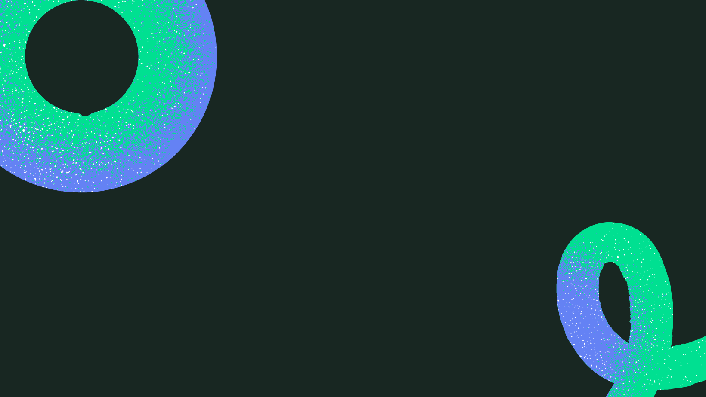

- 👋 Hi , I'm Venuzia
- 🌱 I’m currently learning ...
- 👯 I’m looking to collaborate on ...
- 🤔 I’m looking for help with ...
- 📫 How to reach me: ...

Welcome to my github progfile!

### Who am i?

My name is Venuzia, i am a web developer in training (poec) at the wild code school.I started my retraining in January 2021 where I was able to improve my skills in front-ent technologies, namely: html/css, javascrpit, React and now Angular.
Today I also want to learn back-end languages because my goal is to become a full-stack developer.
passionate about digital with a strong desire to evolve professionally in this field, I am looking for a professional contract for an 18-month training on JAVA ANGULAR / ANDROID STUDIO - SPECIALIZATION DEVOPS.

### What am i learning right now ?

### my current projects

<ul>
<li>Groom: a room reservation application full-stack Angular/java (as part of my current training) </li>
<li>My portfolio</li>

</ul>
You can find here some of my work:
Professional project with yalinov https://yalinov.bordeaux-1.wilders.dev/

### How can you reach me?

<ol>
<li>vbabonguimabika@gmail.com</li>
</ol>

