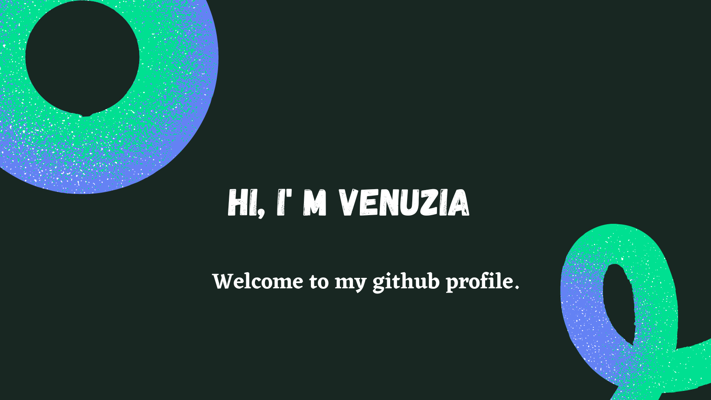

- 🌱 I’m currently learning ...
- 👯 I’m looking to collaborate on ...
- 🤔 I’m looking for help with ...
- 📫 How to reach me: ...

 

## :tipping_hand_woman: Who am i?

I'm a web developer in training (poec) at the wild code school.I started my retraining in January 2021 where I was able to improve my skills in front-ent technologies, namely: html/css, javascrpit, React and now Angular.
Today I also want to learn back-end languages because my goal is to become a full-stack developer.
passionate about digital with a strong desire to evolve professionally in this field, I am looking for a professional contract for an 18-month training on <strong>Java Angular / Android Studio -DEVOPS</strong>.

 

## :briefcase: Technology & Tools

 
 

 
 
 

 

## :pushpin: My current projects

<ul>
<li>Groom: a room reservation application full-stack Angular/java (as part of my current training) </li>
<li>My portfolio</li>

</ul>
You can find here some of my work:
Professional project with yalinov https://yalinov.bordeaux-1.wilders.dev/

 

## &#x1f4c8; GitHub Stats

 

## :mailbox_closed: How can you reach me?

   

 

## :movie_camera: My visitors

 
  Visitors count 
  
  

